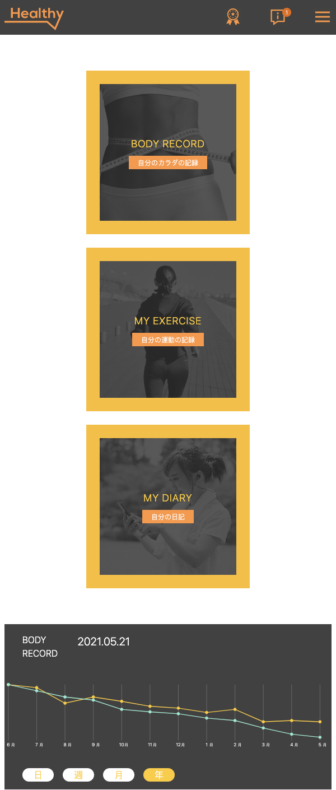

# Health Application

## Quick Overview

### Problem

The problem was to create a health application that looks and behaves like a real-world application. The application needed to have several pages, including charts, a meal tracker, and an exercise log.

### Solution

To solve this problem, I used React and Next.js to create the application's frontend. I used Tailwind CSS to style the application. To simulate real API requests, I created mock API requests to fetch mock data and display them on the pages.

### \*\*\* **Bonus features** \*\*\* :

- On Top page, implement **filter** functions that allow users to filter meals by clicking on categories: Morning, Lunch, Dinner, and Snack.
- Implement **mock APIs** that simulate real API requests and return mock data for the following APIs:

  - Achievement rate API
  - Body record graph API
  - Meal history API
  - My exercise API
  - My diary API
  - Article API

- Display a **loading spinner** while fetching data from each API for every widget.
- Make all three pages **responsive** on all screen sizes.
- Write a few **test cases** to demonstrate the testing aspect.

### Demo

To verify that the application is working as intended, please visit these links:

- [Top page](https://arent-health-web-app.vercel.app/)
- [My Record Page](https://arent-health-web-app.vercel.app/record-page)
- [Column Page](https://arent-health-web-app.vercel.app/column-page)

## Table of Contents

- [Table of Contents](#table-of-contents)
- [Design](#design)
- [Project Screenshots](#project-screenshots)
- [Technologies](#technologies)
- [Project Structure](#project-structure)
- [Code Formatting & Linting](#code-formatting--linting)
- [Git Workflow](#git-workflow)
- [Coding Standards](#coding-standards)
- [Change Log](#change-log)
- [Setup / Installation](#setup--installation)

## Design

Figma design: [Design](https://www.figma.com/file/7qqT3dvv5OagaRlUFK01vB/HealthApp_1203?node-id=0-1&t=10Z73PiiTLbj7pWu-0)

## Project Screenshots

### Top Page

- Desktop View


- Mobile View


### My Record Page

- Desktop View


- Mobile View




### Column Page

- Desktop View


- Mobile View


[Back to Table of Contents](#table-of-contents)

## Technologies

### Core

- **React (18.2.0)**
- **NextJS**
- **TypeScript**

### Styling

- **Tailwind CSS**: used for styling components, page layout,...

### Testing

- **React testing library**: React component testing
- **Jest**: utility testing

### Hosting and Deployment

- **Vercel**: hosting & continuous deployment

[Back to Table of Contents](#table-of-contents)

## Project Structure

```
figures              ---> images/screenshots for Readme.md
api
├── mockData         ---> mock data (meals, diary, graph data,...)
└── MockAPI.ts       ---> mock API fetch mock data
public               ---> contains images, icons, etc.
├── icons
└── images
hooks                ---> reusable custom hooks (e.g API fetch)
layouts              ---> layout components defining common structure of a page which then used in all pages
components
├── PageAComponent   ---> Components used in a page
|   ├── ComponentA.tsx
|   ├── ComponentB.tsx
|   └── ComponentC.tsx
├── PageBComponent
|   ├── ComponentA.tsx
|   ├── ComponentB.tsx
|   └── ComponentC.tsx
└── shared           ---> Components shared across all pages
   ...
pages
├── pageA            ---> a page of the application (correspond to a route)
|   └── index.tsx
├── pageB
    └── index.tsx
   ...
utils
├── moduleA          ---> util module for important calculation
└──tests             ---> unit tests for each module
    ├── fn1.test.ts
    ├── fn2.test.ts
    ...
tailwind.config.js   ---> define global style variables such as colors + plugins
README.md
```

[Back to Table of Contents](#table-of-contents)

[Back to Table of Contents](#table-of-contents)

## Unit Testing

### Utility Testing

- Used Jest to test utility functions (such as getTripDuration, convertDateFormat)
- The test files are located inside the utils folder:
  - `utils / __tests__ / (all test files)`

### Component Testing

- Used React testing library to test each React component
- The test files are located inside the component folder:
  - `components / __tests__ / [component].test.jsx`
- (However, I did not write all the tests)

[Back to Table of Contents](#table-of-contents)

## Code Formatting & Linting

- Use Prettier as code formatter to auto format code (on Save). Rules defined in `.prettierrc`. (to avoid conflicting formatting between developers)
- Use Eslint to find errors in code. Rules defined in `.eslintrc`

[Back to Table of Contents](#table-of-contents)

## Git Workflow

Typically we would have a file documenting and explaining the Git Workflow used for this project so that every developer must strictly follow (e.g git-workflow.md)

[Back to Table of Contents](#table-of-contents)

## Coding Standards

Typically, in order for every developer to follow the same consistent coding standards in the same project, we include a coding standards/best practices file (e.g coding-standards.md)

[Back to Table of Contents](#table-of-contents)

## Change Log

Normally we would have a change log file (e.g CHANGELOG.MD) to document all the notable changes to this project.

[Back to Table of Contents](#table-of-contents)

## Setup / Installation

`node` and `npm` (or `yarn`) are required to be installed on your machine.

Clone this repository.

Installation:

`yarn install` (or npm install)

Then, run the development server:

```bash
npm run dev
# or
yarn dev
# or
pnpm dev
```

Open [http://localhost:3000](http://localhost:3000) with your browser to see the result.
